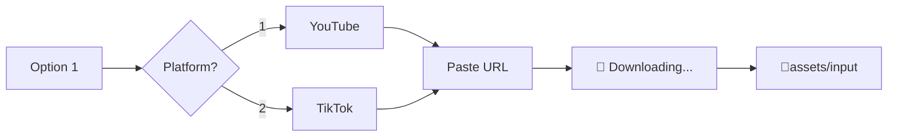

# 📥 Documentation: Video Download (YouTube & TikTok)

This module allows you to download videos from the most popular platforms directly into the `assets/input` folder, ready to be processed by AI or the editors.

---

## 🚀 How it Works

By selecting **Option 1** from the main menu, the service will guide you through platform selection and the download process.



### Main Features
- **High Quality**: Automatically looks for the best video and audio combination (MP4).
- **Progress Bar**: Real-time display of file size, download speed, and remaining time.
- **Sanitization**: Automatically cleans filenames to prevent issues on Windows filesystems.
- **Integration**: Videos are saved directly to the project's standard input folder.

---

## 🛠️ User Interface (Terminal)

This is what the process looks like in your terminal:

```console
Select an option [2]: 1

Download Platform:
1. YouTube
2. TikTok
Choose platform [1]: 1

Paste the YouTube URL: https://www.youtube.com/watch?v=XXXXX

📥 Downloading video from YouTube: https://www.youtube.com/watch?v=XXXXX
⠋ [bold blue]My_Viral_Video[/] ━━━━━━━━━━━━━━━━━━━━╸ 98.5% • 45.2MB • 2.5MB/s • 00:01

✅ Video downloaded in Input:
assets\input\My_Viral_Video.mp4

Now you can select it in Option 2.
```

---

## 🍪 Advanced Features

### Cookies Support
Some platforms (especially TikTok or restricted YouTube videos) might block automated downloads. The service supports using cookies to bypass this:

1. **`cookies.txt` File**: Place a `cookies.txt` file in the project root (Netscape format). The program will detect and use it automatically.
2. **Environment Variables**: You can export your cookies as environment variables:
   - `YOUTUBE_COOKIES`
   - `TIKTOK_COOKIES`

### Error Handling
If a download fails, the system will notify you of the reason (invalid URL, connection error, etc.) and allow you to return to the main menu without crashing the program.

---

## 🛠️ Technical Specifications

For developers and system maintenance.

### Related Files
- **[`src/shared/youtube.py`](file:///c:/Users/C%C3%A9sar%20Andr%C3%A9s/Desktop/AI%20Agents/opus-video-service/src/shared/youtube.py)**: Central logic for YouTube downloads.
- **[`src/shared/tiktok.py`](file:///c:/Users/C%C3%A9sar%20Andr%C3%A9s/Desktop/AI%20Agents/opus-video-service/src/shared/tiktok.py)**: Central logic for TikTok downloads.
- **[`src/shared/exceptions.py`](file:///c:/Users/C%C3%A9sar%20Andr%C3%A9s/Desktop/AI%20Agents/opus-video-service/src/shared/exceptions.py)**: Definition of custom exceptions like `YouTubeDownloadError`.
- **[`src/cli/menu.py`](file:///c:/Users/C%C3%A9sar%20Andr%C3%A9s/Desktop/AI%20Agents/opus-video-service/src/cli/menu.py)**: Integration with the Terminal UI.

### Main Functions
- `download_youtube_video(url, output_dir)`: Orchestrates YouTube downloading process.
- `download_tiktok_video(url, output_dir)`: Orchestrates TikTok downloading process.
- `sanitize_filename(filename)`: Utility to ensure filesystem compatibility on Windows.

### Libraries Used
- **`yt-dlp`**: The core download engine (successor to youtube-dl).
- **`rich`**: Manages dynamic progress bars and terminal aesthetics.
- **`pathlib` / `os`**: Cross-platform path management.

---

> [!TIP]
> If you download a very long YouTube video, remember that **Option 2** (Viral AI Shorts) is ideal for having the AI find the best moments for you automatically.
