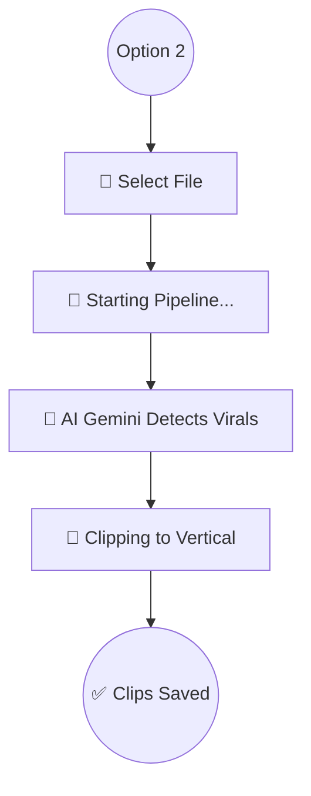
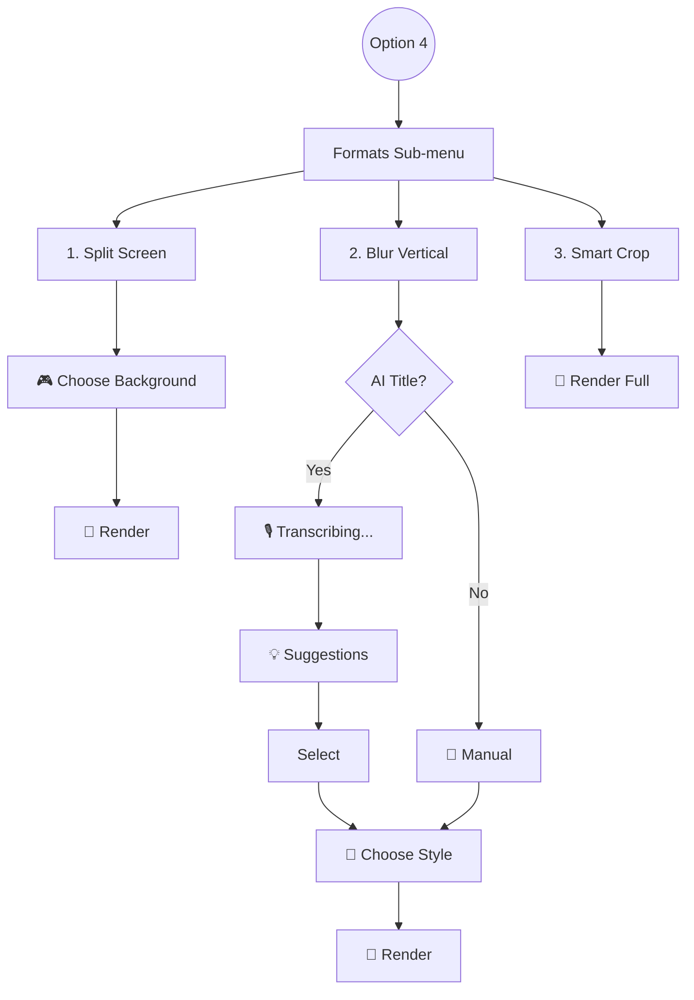

# 🗺️ Visual Workflow Guide

This guide shows **exactly** what you will see in the terminal and what happens at each step.

---

## 🎬 Start Screen

When running `start_worker.py`, you will see the banner and the main menu styled with the `Rich` library.

```console
   ____                  _     __     ___     _             
  / __ \                | |    \ \   / (_)   | |            
 | |  | |_ __  _   _ ___| |_____\ \ / / _  __| | ___  ___   
 | |  | | '_ \| | | / __| |______\ \ / | |/ _` |/ _ \/ _ \  
 | |__| | |_) | |_| \__ \_|       \ V /| | (_| |  __/ (_) | 
  \____/| .__/ \__,_|___(_)        \_/ |_|\__,_|\___|\___/  
        | |                                                 
        |_|                                                 

              Opus Video Service - AI Short Creator
                 v1.0.0 | Powered by Gemini & Whisper


  ╭── 🔥 Opus Video Service - Main Menu ────────────────────────╮
  │                                                             │
  │  1. 📥 Download Video (YouTube / TikTok)                    │
  │  2. 🚀 Viral AI Shorts (Detection and Clipping)             │
  │  3. 📝 Generate Subtitles (Full Video or Clip)              │
  │  4. 🎨 Editor: Vertical Formats (Split/Blur/Smart-Crop)     │
  │  5. ✨ Editor: Add 'Hook' Effects (Zoom/Flash)               │
  │  6. 🎵 Audio: Add Background Music                          │
  │  7. ⚡ Speed: Speed up / Slow down                          │
  │  8. 🔇 Audio: Remove Sound (Mute)                           │
  │  9. 🎞️  60 FPS: Convert to Sixty                            │
  │  10. ✂️  Audio: Remove Silences (Auto-trim)                  │
  │  11. 📱 AI: Generate Social Media Copy (Titles/Captions)    │
  │  12. 🚪 Exit                                                │
  │                                                             │
  ╰─────────────────────────────────────────────────────────────╯
  Select an option [2]: 
```

---

## 🗺️ Decision Trees by Option

Below is the visual flow of each important option.

### Option 2: Viral AI Shorts

Ideal for creating short clips automatically. Following the modular design philosophy, this option **only** detects and crops the clips.



> [!TIP]
> If you want to add subtitles to the generated clips, use **Option 3** afterwards on the files in the `output` folder.

#### What you will see in the terminal:

```console
📹 Available Videos in Input:
1. long_podcast.mp4
2. tech_conference.mp4
Choose video to process [1]: 1

✅ File to process: long_podcast.mp4
🚀 Starting Pipeline...
```

---

### Option 4: Vertical Formats Editor

Transforms horizontal videos to vertical with different styles.



#### What you will see in the terminal:

**Step 1: Formats Sub-menu**
```console
  ╭── 🎨 Vertical Formats Editor ────────────────────────────────╮
  │ 1. ✂️  Split Screen (Reaction Style / Gameplay)              │
  │ 2. 💧 Aesthetic Blur Background (Centered video + blur)      │
  │ 3. 🎞️  Smart Vertical Conversion (Full video)                │
  │ 4. 🔙 Back to Main Menu                                      │
  ╰──────────────────────────────────────────────────────────────╯
  Select an option [1]: 2
```

**Step 2: Aesthetic Title (Only in Blur Vertical)**
```console
🧠 Generate AI title (based on audio)? [Y/n]: y
🎙️  Transcribing audio for title... [dots]
✨ Generating viral titles... [earth]

💡 Suggested Titles:
1. Pro-Player Strategies
2. The Error that costs you the game
Choose a title [1]: 1
```

> [!NOTE]
> Hook effects and social descriptions have been moved to their own options (5 and 11) for a cleaner workflow.

---

### Other Audio & Video Utilities

#### 🎵 Option 6: Add Music
Mix audio with precise volume control.
```console
🔊 Background music volume:
  0.1 = Very soft
  0.3 = Soft - Recommended
  0.5 = Medium
Enter volume [0.3]: 0.1
🎵 Mixing audio... [wave]
```

#### ⚡ Option 7: Speed Adjustment
```console
Select Speed Factor:
1. 0.5x (Slow Motion)
2. 1.1x (Light Retention - Recommended)
...
3. Custom
```

#### ✂️ Option 10: Remove Silences
Automatically cleans silences from a video (Jump cuts).
```console
Silence Configuration:
Minimum duration (ms) [1500]: 800
Audio padding (ms) [500]: 200
✂️  Removing silences... [bouncingBall]
```

#### 📱 Option 11: Social Media AI
Generates optimized titles and descriptions for each platform based on the video's audio.
```console
🎙️  Transcribing audio for context... [dots]
✨ Generating viral titles... [earth]
📱 Generating social media captions... [point]

✅ Content Generated:
(Shows blocks for TikTok, Instagram, and YouTube)
💾 Saved in: video_social_media.txt
```

---

## ⚠️ Common Errors Detail

> [!WARNING]
> **FFMPEG Error**: If you see `ffmpeg not found`, make sure you have FFmpeg installed and added to Windows environment variables. The program checks this at startup.

> [!NOTE]
> **First Run**: The first time you run the program, you will see the message `🚀 First run detected`. This is normal, it is creating the `.venv` (virtual environment) so you don't have dependency issues.
