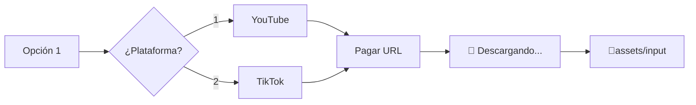

# 📥 Documentación: Descarga de Videos (YouTube & TikTok)

Este módulo permite bajar videos de las plataformas más populares directamente a la carpeta `assets/input`, listos para ser procesados por la IA o los editores.

---

## 🚀 Cómo funciona

Al seleccionar la **Opción 1** del menú principal, el servicio te guiará a través de la selección de plataforma y la descarga.



### Características Principales
- **Alta Calidad**: Busca automáticamente la mejor combinación de video y audio (MP4).
- **Barra de Progreso**: Visualización en tiempo real del tamaño, velocidad y tiempo restante.
- **Sanitización**: Limpia automáticamente los nombres de los archivos para evitar errores en Windows.
- **Integración**: El video se guarda en la carpeta de entrada reglamentaria del proyecto.

---

## 🛠️ Interfaz de Usuario (Terminal)

Así es como verás el proceso en tu terminal:

```console
Selecciona una opción [2]: 1

Plataforma de Descarga:
1. YouTube
2. TikTok
Elige plataforma [1]: 1

Pega la URL de YouTube: https://www.youtube.com/watch?v=XXXXX

📥 Descargando video de YouTube: https://www.youtube.com/watch?v=XXXXX
⠋ [bold blue]Mi_Video_Viral[/] ━━━━━━━━━━━━━━━━━━━━╸ 98.5% • 45.2MB • 2.5MB/s • 00:01

✅ Video descargado en Input:
assets\input\Mi_Video_Viral.mp4

Ahora puedes seleccionarlo en la opción 2.
```

---

## 🍪 Funcionalidades Avanzadas

### Soporte de Cookies
Algunas plataformas (especialmente TikTok o videos de YouTube con restricción) pueden bloquear las descargas automáticas. El servicio soporta el uso de cookies para evitar esto:

1. **Archivo `cookies.txt`**: Coloca un archivo `cookies.txt` en la raíz del proyecto (formato Netscape). El programa lo detectará y usará automáticamente.
2. **Variables de Entorno**: Puedes exportar tus cookies como variables de entorno:
   - `YOUTUBE_COOKIES`
   - `TIKTOK_COOKIES`

### Gestión de Errores
Si una descarga falla, el sistema te avisará el motivo (URL inválida, error de conexión, etc.) y te permitirá volver al menú principal sin cerrar el programa.

---

## 🛠️ Especificaciones Técnicas

Para desarrolladores y mantenimiento del sistema.

### Archivos Relacionados
- **[`src/shared/youtube.py`](file:///c:/Users/C%C3%A9sar%20Andr%C3%A9s/Desktop/AI%20Agents/opus-video-service/src/shared/youtube.py)**: Lógica central para YouTube.
- **[`src/shared/tiktok.py`](file:///c:/Users/C%C3%A9sar%20Andr%C3%A9s/Desktop/AI%20Agents/opus-video-service/src/shared/tiktok.py)**: Lógica central para TikTok.
- **[`src/shared/exceptions.py`](file:///c:/Users/C%C3%A9sar%20Andr%C3%A9s/Desktop/AI%20Agents/opus-video-service/src/shared/exceptions.py)**: Definición de errores como `YouTubeDownloadError`.
- **[`src/cli/menu.py`](file:///c:/Users/C%C3%A9sar%20Andr%C3%A9s/Desktop/AI%20Agents/opus-video-service/src/cli/menu.py)**: Integración con la interfaz de usuario.

### Funciones Principales
- `download_youtube_video(url, output_dir)`: Orquestador de la descarga en YouTube.
- `download_tiktok_video(url, output_dir)`: Orquestador de la descarga en TikTok.
- `sanitize_filename(filename)`: Función de utilidad para asegurar compatibilidad de archivos en Windows.

### Librerías Utilizadas
- **`yt-dlp`**: El motor principal de descarga (sucesor de youtube-dl).
- **`rich`**: Gestiona las barras de progreso dinámicas y el estilo de la terminal.
- **`pathlib` / `os`**: Gestión de rutas multiplataforma.

---

> [!TIP]
> Si descargas un video de YouTube muy largo, recuerda que la **Opción 2** (Shorts Virales) es ideal para que la IA encuentre los mejores momentos por ti automáticamente.
