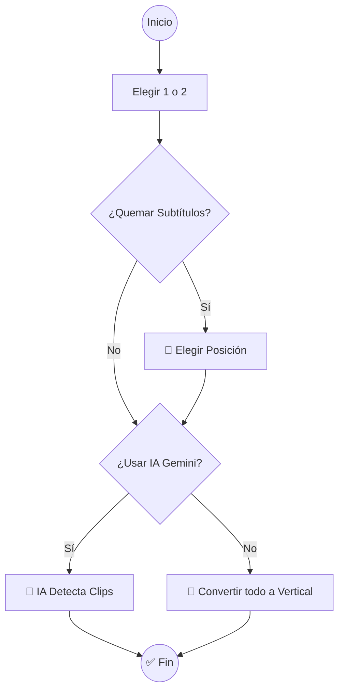
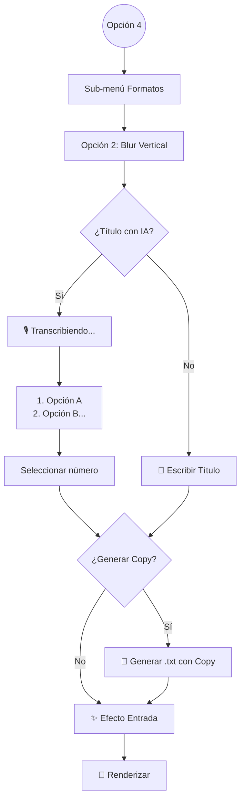
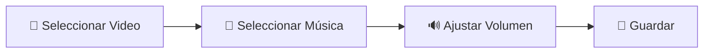

1# 🗺️ Guía Visual del Flujo de Trabajo

Esta guía muestra **exactamente** qué verás en la terminal y qué sucede en cada paso.

---

## 🎬 Pantalla de Inicio

Al ejecutar `start_worker.py`, verás el banner y el menú principal.

```console
   ____                  _     __     ___     _             
  / __ \                | |    \ \   / (_)   | |            
 | |  | |_ __  _   _ ___| |_____\ \ / / _  __| | ___  ___   
 | |  | | '_ \| | | / __| |______\ \ / | |/ _` |/ _ \/ _ \  
 | |__| | |_) | |_| \__ \_|       \ V /| | (_| |  __/ (_) | 
  \____/| .__/ \__,_|___(_)        \_/ |_|\__,_|\___|\___/  
        | |                                                 
        |_|                                                 

              Opus Video Service - AI Short Creator
                 v1.0.0 | Powered by Gemini & Whisper


  ╭── 🔥 Opus Video Service - Menú Principal ───────────────────╮
  │                                                             │
  │  1. 🧠 Encontrar Clips Virales (YouTube URL)                │
  │  2. 📂 Encontrar Clips Virales (Archivo Local)              │
  │  3. 📝 Generar Subtítulos (Video Completo)                  │
  │  4. 🎨 Editor: Formatos Verticales (Split/Blur)             │
  │  5. ✨ Editor: Agregar Efectos 'Hook' (Zoom/Flash)          │
  │  6. 🎵 Audio: Agregar Música de Fondo                       │
  │  7. 🚪 Salir                                                │
  │                                                             │
  ╰─────────────────────────────────────────────────────────────╯
  Selecciona una opción [2]: 
```

---

## �️ Árboles de Decisión por Opción

A continuación, el flujo visual de cada opción importante.

### Opción 1 y 2: Buscador de Virales (YouTube/Local)

Ideal para crear clips cortos automáticamente.



#### Lo que verás en la terminal:

**Paso 1: Configuración**
```console
Configuración del Trabajo:
📜 ¿Quieres quemar subtítulos en el video? [y/N]: y
📍 Posición de subtítulos [bottom]: middle
```

**Paso 2: Decisión de Inteligencia Artificial**
```console
Análisis con IA (Gemini):
- Sí: Detecta clips virales automáticamente
- No: Convierte todo el video a vertical (sin cortes)
🧠 ¿Usar IA para detectar virales? [Y/n]: 
```

---

### Opción 4.2: Editor Blur Vertical

Transforma videos horizontales a verticales con fondo borroso y títulos llamativos.



#### Lo que verás en la terminal:

**Paso 1: Selección del formato**
```console
  ╭── 🎨 Editor de Formatos ──────────────────────╮
  │ 1. ✂️  Split Screen (Input + Gameplay)        │
  │ 2. 💧 Blur Vertical (Input + Fondo Borroso)   │
  │ 3. 🔙 Volver al Menú Principal                │
  ╰───────────────────────────────────────────────╯
  Selecciona una opción [1]: 2
```

**Paso 2: Asistente de Títulos**
```console
🧠 ¿Generar título con IA (basado en audio)? [Y/n]: y
🎙️  Transcribiendo audio para título... ⠋
✨ Generando títulos virales... 
💡 Títulos Sugeridos:
1. El Secreto Revelado
2. Increíble Historia
3. [Escribir Manualmente]
Elige un título [1]: 
```

**Paso 3: Descripciones (Copy)**
```console
📝 ¿Generar descripciones para redes sociales? [y/N]: y
✨ Generando descripciones...
💾 Descripciones guardadas en: mijuego_descriptions.txt
```

---

### Opción 6: Música de Fondo

Mezcla audio con control preciso de volumen.



#### Lo que verás en la terminal:

```console
✅ Video seleccionado: clip_final.mp4
🎵 Música seleccionada: lofi_chill.mp3

🔊 Volumen de música de fondo:
  0.1 = Muy suave (10%)
  0.3 = Suave (30%) - Recomendado
  0.5 = Medio (50%)
  0.7 = Alto (70%)
Ingresa volumen [0.3]: 0.5
```

---

## ⚠️ Detalle de Errores Comunes

> [!WARNING]
> **Error FFMPEG**: Si ves `ffmpeg not found`, asegúrate de tener FFmpeg instalado y agregado a las variables de entorno de Windows. El programa lo comprueba al inicio.

> [!NOTE]
> **Primera Ejecución**: La primera vez que corras el programa, verás el mensaje `🚀 Primera ejecución detectada`. Esto es normal, está creando la carpeta `.venv` (entorno virtual) para que no tengas problemas de dependencias.
