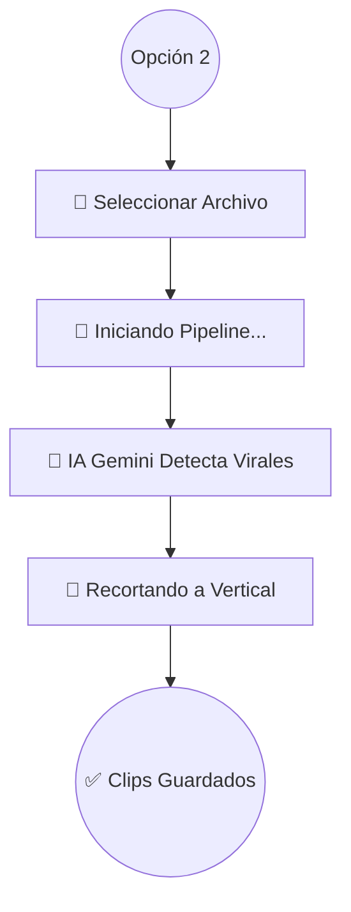
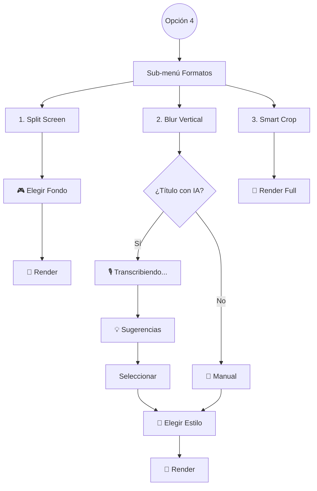

1# 🗺️ Guía Visual del Flujo de Trabajo

Esta guía muestra **exactamente** qué verás en la terminal y qué sucede en cada paso.

---

## 🎬 Pantalla de Inicio

Al ejecutar `start_worker.py`, verás el banner y el menú principal estilizado con la librería `Rich`.

```console
   ____                  _     __     ___     _             
  / __ \                | |    \ \   / (_)   | |            
 | |  | |_ __  _   _ ___| |_____\ \ / / _  __| | ___  ___   
 | |  | | '_ \| | | / __| |______\ \ / | |/ _` |/ _ \/ _ \  
 | |__| | |_) | |_| \__ \_|       \ V /| | (_| |  __/ (_) | 
  \____/| .__/ \__,_|___(_)        \_/ |_|\__,_|\___|\___/  
        | |                                                 
        |_|                                                 

              Opus Video Service - AI Short Creator
                 v1.0.0 | Powered by Gemini & Whisper


  ╭── 🔥 Opus Video Service - Menú Principal ───────────────────╮
  │                                                             │
  │  1. 📥 Descargar Video (YouTube / TikTok)                   │
  │  2. 🚀 Shorts Virales con IA (Detección y Recorte)          │
  │  3. 📝 Generar Subtítulos (Video Completo o Clip)           │
  │  4. 🎨 Editor: Formatos Verticales (Split/Blur/Smart-Crop)  │
  │  5. ✨ Editor: Agregar Efectos 'Hook' (Zoom/Flash)          │
  │  6. 🎵 Audio: Agregar Música de Fondo                       │
  │  7. ⚡ Velocidad: Acelerar / Ralentizar                      │
  │  8. 🔇 Audio: Quitar Sonido (Mute)                          │
  │  9. 🎞️  60 FPS: Convertir a Sesenta                         │
  │  10. ✂️  Audio: Eliminar Silencios (Auto-trim)               │
  │  11. 📱 AI: Generar Copys y Títulos (Redes Sociales)        │
  │  12. 🚪 Salir                                               │
  │                                                             │
  ╰─────────────────────────────────────────────────────────────╯
  Selecciona una opción [2]: 
```

---

## �️ Árboles de Decisión por Opción

A continuación, el flujo visual de cada opción importante.

### Opción 2: Shorts Virales con IA

Ideal para crear clips cortos automáticamente. Siguiendo la filosofía de diseño modular, esta opción **solo** se encarga de detectar y recortar los clips.


```mermaid
graph TD
    Start((Opción 2)) --> Select[📁 Seleccionar Archivo]
    Select --> Pipe[🚀 Iniciando Pipeline...]
    Pipe --> Detect[🧠 IA Gemini Detecta Virales]
    Detect --> Render[🔨 Recortando a Vertical]
    Render --> Finish((✅ Clips Guardados))
```

> [!TIP]
> Si quieres ponerle subtítulos a los clips generados, usa luego la **Opción 3** sobre los archivos en la carpeta `output`.

#### Lo que verás en la terminal:

```console
📹 Videos disponibles en Input:
1. podcast_largo.mp4
2. conferencia_tech.mp4
Elige el video a procesar [1]: 1

✅ Archivo para procesar: podcast_largo.mp4
🚀 Iniciando Pipeline...
```

---

### Opción 4: Editor de Formatos Verticales

Transforma videos horizontales a verticales con diferentes estilos.


```mermaid
graph TD
    Start((Opción 4)) --> SubMenu[Sub-menú Formatos]
    SubMenu --> Split[1. Split Screen]
    SubMenu --> Blur[2. Blur Vertical]
    SubMenu --> Smart[3. Smart Crop]
    
    Split --> Med[🎮 Elegir Fondo]
    Med --> RenderS[🔨 Render]
    
    Blur --> TitleAI{¿Título con IA?}
    TitleAI -- Sí --> Transcribe[🎙️ Transcribiendo...]
    Transcribe --> List[💡 Sugerencias]
    List --> Select[Seleccionar]
    TitleAI -- No --> Manual[📝 Manual]
    Select --> Style[🎨 Elegir Estilo]
    Manual --> Style
    Style --> RenderB[🔨 Render]
    
    Smart --> RenderC[🔨 Render Full]
```

#### Lo que verás en la terminal:

**Paso 1: Sub-menú de Formatos**
```console
  ╭── 🎨 Editor de Formatos Verticales ──────────────────────────╮
  │ 1. ✂️  Pantalla Dividida (Estilo Reacción / Gameplay)        │
  │ 2. 💧 Fondo Borroso Estético (Video centrado + blur)         │
  │ 3. 🎞️  Conversión Inteligente a Vertical (Todo el video)     │
  │ 4. 🔙 Volver al Menú Principal                               │
  ╰──────────────────────────────────────────────────────────────╯
  Selecciona una opción [1]: 2
```

**Paso 2: Título Estético (Solo en Blur Vertical)**
```console
🧠 ¿Generar título con IA (basado en audio)? [Y/n]: y
🎙️  Transcribiendo audio para título... [dots]
✨ Generando títulos virales... [earth]

💡 Títulos Sugeridos:
1. Estrategias Pro-Player
2. El Error que te cuesta la partida
Elige un título [1]: 1
```

> [!NOTE]
> Los efectos de entrada (Hooks) y las descripciones de redes han sido movidos a sus propias opciones (5 y 11) para un flujo de trabajo más limpio.

---

### Otras Utilidades de Audio y Video

#### 🎵 Opción 6: Agregar Música
Mezcla audio con control preciso de volumen.
```console
🔊 Volumen de música de fondo:
  0.1 = Muy suave
  0.3 = Suave - Recomendado
  0.5 = Medio
Ingresa volumen [0.3]: 0.1
🎵 Mezclando audio... [wave]
```

#### ⚡ Opción 7: Ajuste de Velocidad
```console
Selecciona el Factor de Velocidad:
1. 0.5x (Cámara Lenta)
2. 1.1x (Retención Ligera - Recomendado)
...
3. Personalizado
```

#### ✂️ Opción 10: Eliminar Silencios
Limpia automáticamente los silencios de un video (Jump cuts).
```console
Configuración de Silencio:
Duración mínima (ms) [1500]: 800
Margen de audio (padding ms) [500]: 200
✂️  Eliminando silencios... [bouncingBall]
```

#### 📱 Opción 11: IA Social Media
Genera títulos y descripciones optimizadas para cada plataforma basándose en el audio del video.
```console
🎙️  Transcribiendo audio para contexto... [dots]
✨ Generando títulos virales... [earth]
📱 Generando descripciones para redes... [point]

✅ Contenido Generado:
(Muestra bloques para TikTok, Instagram y YouTube)
💾 Guardado en: video_social_media.txt
```

---

## ⚠️ Detalle de Errores Comunes

> [!WARNING]
> **Error FFMPEG**: Si ves `ffmpeg not found`, asegúrate de tener FFmpeg instalado y agregado a las variables de entorno de Windows. El programa lo comprueba al inicio.

> [!NOTE]
> **Primera Ejecución**: La primera vez que corras el programa, verás el mensaje `🚀 Primera ejecución detectada`. Esto es normal, está creando la carpeta `.venv` (entorno virtual) para que no tengas problemas de dependencias.
